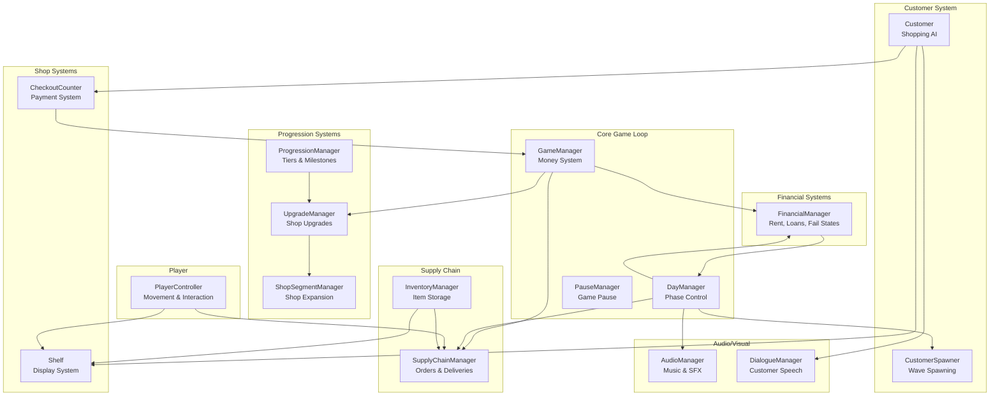
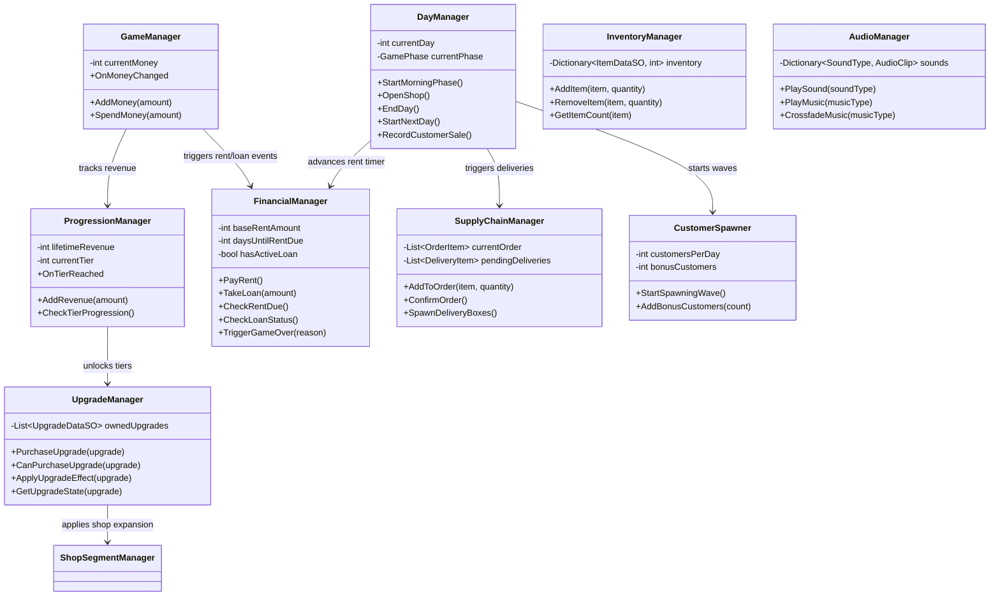
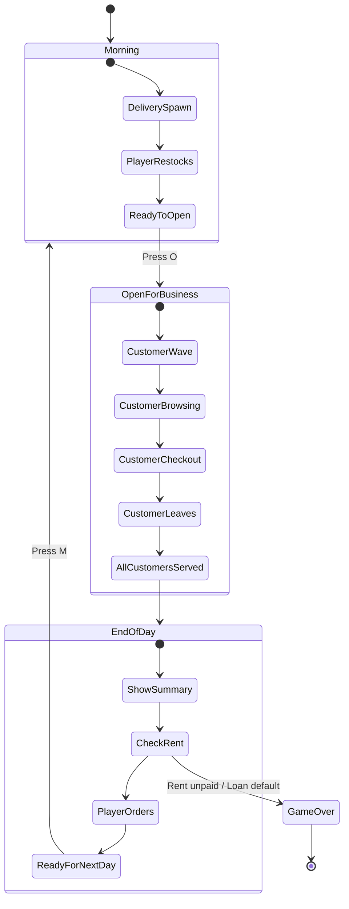
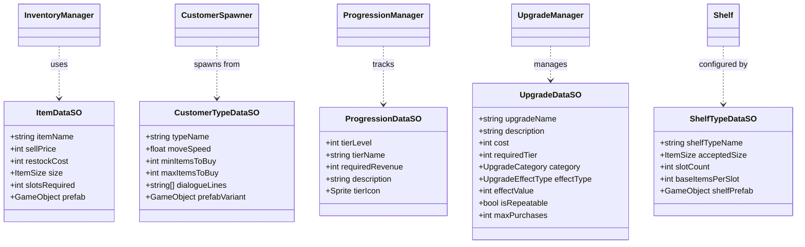
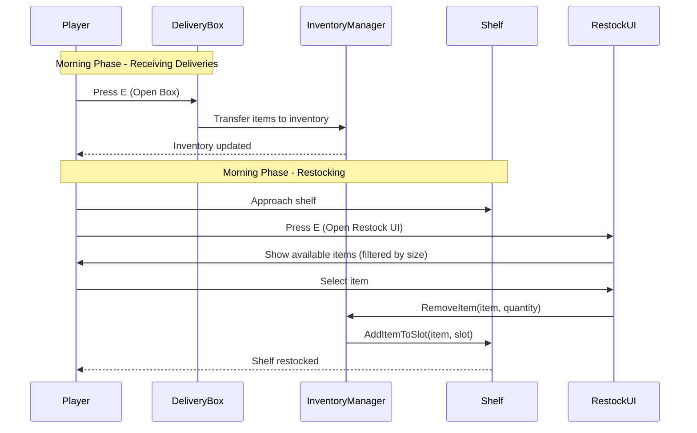
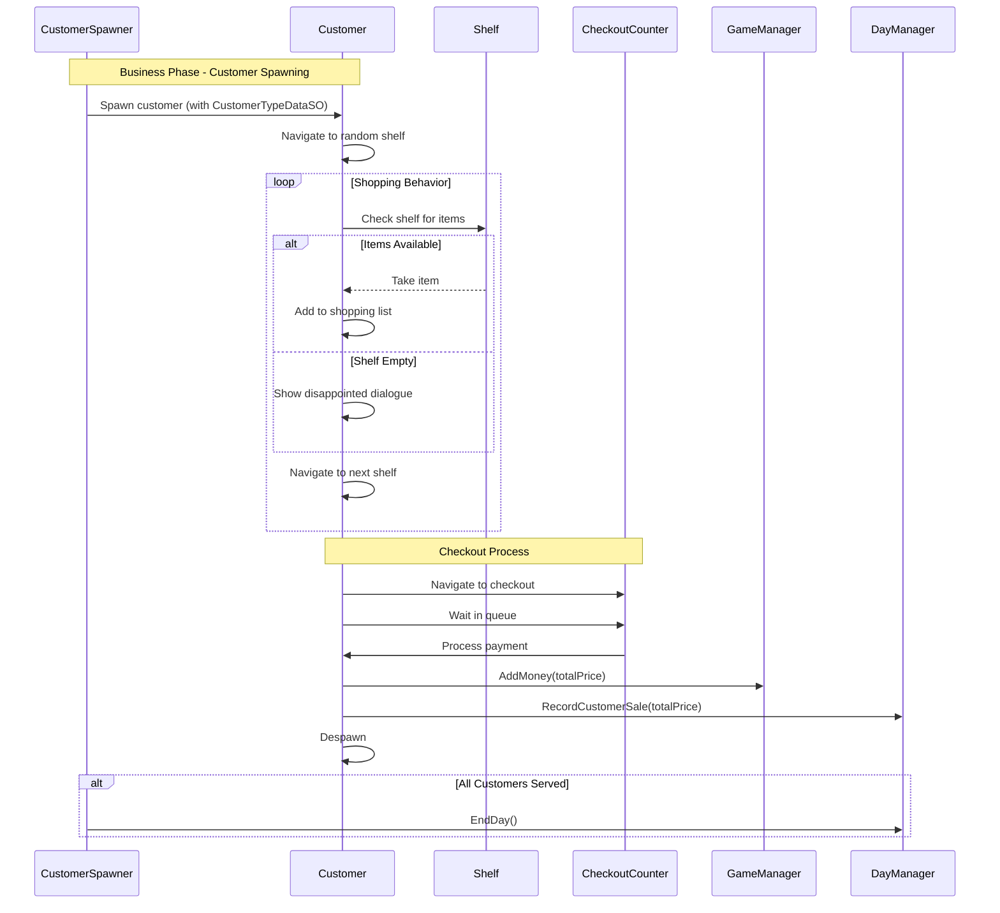
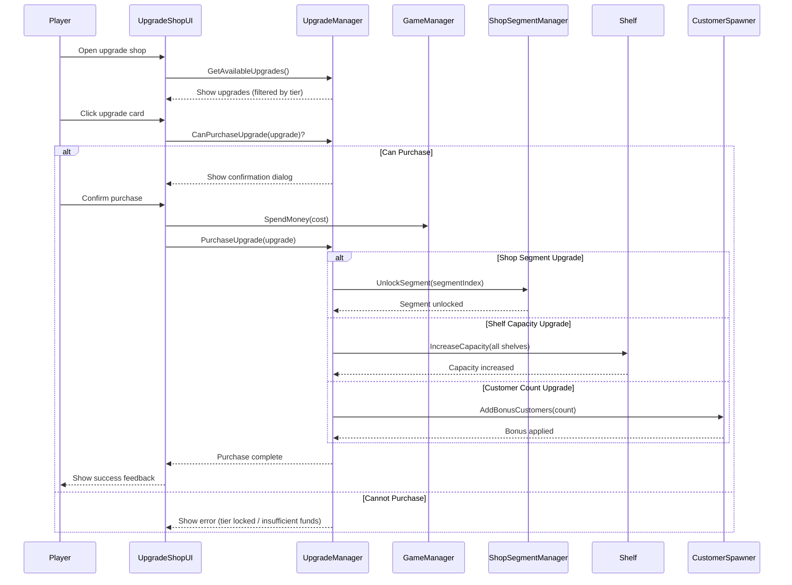
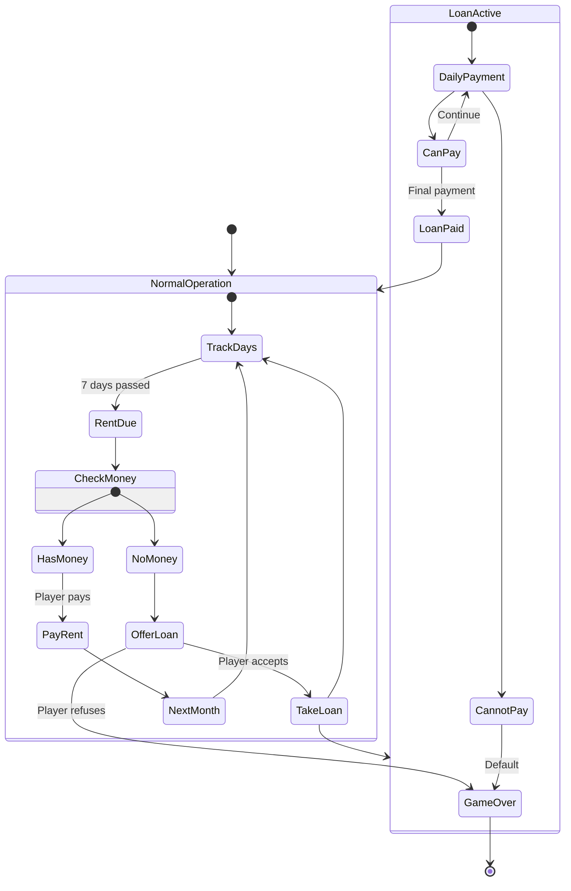
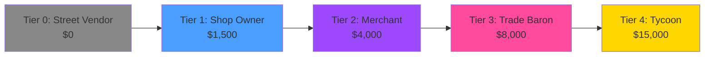

# DungeonMart3D - Architecture Diagram

## Game Overview
DungeonMart3D is a 3D shop management tycoon game built in Unity 6.2 where players run a fantasy item shop, managing inventory, serving customers, and growing their business empire.

---

## 1. High-Level System Architecture



---

## 2. Manager Systems (Singleton Pattern)



---

## 3. Game Loop Flow



---

## 4. Data Architecture (ScriptableObjects)



---

## 5. Player Interaction Flow



---

## 6. Customer AI Flow



---

## 7. Upgrade System Flow



---

## 8. Financial System Flow



---

## 9. UI System Architecture

```mermaid
graph TB
    subgraph "Core UI"
        MD[MoneyDisplay]
        RCD[RentCountdownUI]
        CUI[CustomerCounterUI]
        PUI[ProgressionUI]
        PH[PhaseIndicatorUI]
    end

    subgraph "Menu Systems"
        MM[MainMenuManager]
        PM[PauseMenuUI]
    end

    subgraph "Shop Management UI"
        OM[OrderMenu]
        OMI[OrderMenuItem]
        RUI[RestockUIManager]
        RIB[RestockItemButton]
    end

    subgraph "Financial UI"
        RPU[RentPaymentUI]
        LUI[LoanUI]
        LSU[LoanStatusUI]
    end

    subgraph "Progression UI"
        USU[UpgradeShopUI]
        UC[UpgradeCard]
    end

    subgraph "Summary UI"
        EODS[EndOfDaySummaryUI]
        GOU[GameOverUI]
    end

    subgraph "In-World UI"
        DB[DialogueBubble]
    end

    MD --> GameManager
    RCD --> FinancialManager
    CUI --> CustomerSpawner
    PUI --> ProgressionManager
    PH --> DayManager

    OM --> SupplyChainManager
    OMI --> SupplyChainManager
    RUI --> InventoryManager
    RIB --> InventoryManager

    RPU --> FinancialManager
    LUI --> FinancialManager
    LSU --> FinancialManager

    USU --> UpgradeManager
    UC --> UpgradeManager

    EODS --> DayManager
    GOU --> FinancialManager

    DB --> DialogueManager
```



---

## 10. File Organization

```
DungeonMart3D/
├── Assets/
│   ├── Scenes/
│   │   ├── MainMenu.unity          # Entry point
│   │   └── GameScene.unity         # Main gameplay
│   │
│   ├── Scripts/
│   │   ├── Singletons/             # Core manager systems
│   │   │   ├── GameManager.cs      # Money & core state
│   │   │   ├── DayManager.cs       # Day/phase control
│   │   │   ├── FinancialManager.cs # Rent, loans, fail states
│   │   │   ├── ProgressionManager.cs # Tier progression
│   │   │   ├── UpgradeManager.cs   # Upgrade system
│   │   │   ├── ShopSegmentManager.cs # Shop expansion
│   │   │   ├── SupplyChainManager.cs # Orders & deliveries
│   │   │   ├── InventoryManager.cs # Item storage
│   │   │   ├── CustomerSpawner.cs  # Customer waves
│   │   │   ├── AudioManager.cs     # Sound & music
│   │   │   ├── DialogueManager.cs  # Customer speech
│   │   │   ├── RestockUIManager.cs # Restock interface
│   │   │   ├── PauseManager.cs     # Pause system
│   │   │   └── DebugInputManager.cs # Debug controls
│   │   │
│   │   ├── SOs/                    # Data definitions
│   │   │   ├── ItemDataSO.cs
│   │   │   ├── CustomerTypeDataSO.cs
│   │   │   ├── ProgressionDataSO.cs
│   │   │   ├── UpgradeDataSO.cs
│   │   │   └── ShelfTypeDataSO.cs
│   │   │
│   │   ├── UI/                     # UI controllers
│   │   │   ├── MoneyDisplay.cs
│   │   │   ├── RentPaymentUI.cs
│   │   │   ├── LoanUI.cs
│   │   │   ├── UpgradeShopUI.cs
│   │   │   ├── EndOfDaySummaryUI.cs
│   │   │   ├── GameOverUI.cs
│   │   │   └── ...
│   │   │
│   │   ├── Editor/                 # Unity editor tools
│   │   │   └── ItemDataImporter.cs # CSV importer
│   │   │
│   │   └── (Core Game Scripts)
│   │       ├── PlayerController.cs # Player movement
│   │       ├── Customer.cs         # Customer AI
│   │       ├── Shelf.cs            # Shelf system
│   │       ├── ShelfSlot.cs        # Shelf slot logic
│   │       ├── CheckoutCounter.cs  # Payment system
│   │       ├── DeliveryBox.cs      # Delivery interaction
│   │       ├── Item.cs             # Item data container
│   │       └── OrderMenu.cs        # Order interface
│   │
│   ├── Resources/                  # ScriptableObject assets
│   │   ├── Items/                  # 23 ItemDataSO assets
│   │   ├── CustomerTypes/          # 3 CustomerTypeDataSO assets
│   │   ├── Progression/            # 5 ProgressionDataSO assets
│   │   └── Upgrades/               # 8+ UpgradeDataSO assets
│   │
│   ├── Prefabs/                    # Reusable game objects
│   │   ├── Customers/              # 48 SPUM character variants
│   │   ├── Shelves/                # Small/Medium/Big shelf prefabs
│   │   ├── Items/                  # 3D item model prefabs
│   │   └── UI/                     # UI panel prefabs
│   │
│   ├── Materials/                  # Rendering materials
│   ├── Textures/                   # Image assets
│   └── Audio/                      # Sound effects & music
│       ├── SFX/
│       └── Music/
│
├── CLAUDE.md                       # Development guide
├── README.md                       # Game design document
└── ARCHITECTURE.md                 # This file
```

---

## 11. Key Design Patterns

### Singleton Pattern
All manager classes use the singleton pattern for global access:
```csharp
public static ClassName Instance;
private void Awake() {
    if (Instance != null) { Destroy(gameObject); return; }
    Instance = this;
}
```

### Event-Driven Architecture
Managers communicate through events to reduce coupling:
```csharp
// GameManager
public event System.Action<int, int> OnMoneyChanged;

// DayManager
public event System.Action<GamePhase> OnPhaseChanged;
```

### ScriptableObject Data Pattern
All game data stored in ScriptableObjects for data-driven design:
- Items, Customer Types, Progression Tiers, Upgrades, Shelf Types

### Component-Based Design
- Small, focused components (PlayerController, Customer, Shelf)
- Inspector-assigned references (no GetComponent() searches)
- Prefer SerializeField over public fields

---

## 12. Game Phases Overview

| Phase | Duration | Player Actions | Systems Active |
|-------|----------|----------------|----------------|
| **Morning** | Variable | Open delivery boxes, restock shelves | SupplyChainManager, InventoryManager, Shelf system |
| **Business** | Auto-ends when done | Serve customers, monitor stock | CustomerSpawner, Customer AI, CheckoutCounter |
| **End of Day** | Variable | Review stats, place orders, pay rent | OrderMenu, FinancialManager, ProgressionManager |

---

## 13. Progression System Design



**Tier Benefits:**
- Each tier unlocks new upgrades in the shop
- Higher tiers allow more shop expansions
- Progression tracked via lifetime revenue (not current money)

---

## 14. Upgrade Categories

| Category | Effect Type | Examples |
|----------|-------------|----------|
| **Shelves** | Capacity, Expansion | Efficient Shelving (+2 items/slot), Shelf Expansion (+2 shelves) |
| **Operations** | Automation, Speed | Express Checkout (-25% time), Auto-Restock (morning automation) |
| **Customer Flow** | Volume, Revenue | Extended Hours (+2 customers/day), Bulk Deals (10% discount) |

---

## 15. Technical Notes

### Unity Version
- Unity 6.2 (modern APIs required)
- Use `FindFirstObjectByType<T>()` instead of deprecated `FindObjectOfType<T>()`

### 3D Navigation
- NavMesh-based pathfinding for customer AI
- Top-down camera perspective
- Player movement on XZ plane (Y locked)
- Rigidbody physics with gravity disabled

### WebGL Optimization
- Optimized rendering for browser deployment
- Object pooling for frequently spawned objects (customers, delivery boxes)
- Efficient shelf slot management

### Debug System
- All debug keys wrapped in `#if UNITY_EDITOR || DEVELOPMENT_BUILD`
- Automatic exclusion from release builds
- Centralized in `DebugInputManager.cs`

---

## 16. Known Issues & Limitations

### High Priority
- **Game Over UI Input Blocking**: Input stops working when game over screen appears (under investigation)

### Medium Priority
- **Upgrade Effect Testing**: Backend complete but not fully tested in gameplay
- Effects to test: Shop segments, shelf capacity, customer bonuses, checkout speed

### Future Enhancements
- Tutorial/help system
- Settings menu (audio, keybinds, graphics)
- More item variety
- Customer patience system
- Special customer orders
- Multiple shop floors

---

## 17. Development Workflow

1. **Scripts Only**: Claude writes C# scripts exclusively
2. **Unity Setup**: Human performs Unity Editor work (GameObject creation, Inspector setup)
3. **Read-Only Inspection**: Claude can read scene/prefab files to verify setup
4. **No Asset Modification**: Claude does NOT create/modify Unity files (.unity, .prefab, etc.)

---

## Conclusion

DungeonMart3D uses a clean, event-driven architecture with singleton managers coordinating between systems. The progression system provides long-term goals, while the day cycle creates short-term gameplay loops. ScriptableObjects enable data-driven design, allowing easy balancing and content creation without code changes.

**Current Status**: Core systems complete, Phase 1.2 (Upgrade Shop) complete, Phase 1.3 (Testing) pending.
